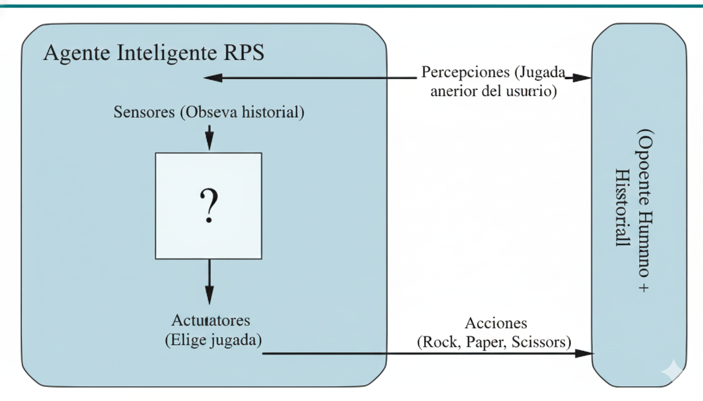

Práctica Axentes Intelixentes
=============================

## Índice
1. [Contorno de tarefas](#contorno-de-tarefas)  
2. [Estrutura do axente](#estrutura-do-axente)  
3. [Requisitos](#requisitos)  
4. [Extensión](#extensión)  
5. [Bibliografía](#bibliografía)

Proponse programar un axente intelixente solución ao entorno de tarefas do xogo pedra, papel, tesoiras, seguindo as directrices de modelado propostas no capítulo 2 _Intelligent Agents_ do libro _IA: A modern approach, Russell & Norvig_.

Para iso é necesario:

1. Especificar as características do contorno de tarefas.
2. Identificar o tipo de axente para determinar a estrutura do axente.
3. Implementar en Python os compoñentes da estrutura do axente para construir a función axente ou función mapa.

## Contorno de tarefas
Características do contorno:

Contorno de tarefas | Observable| Axentes | Determinista | Episódico | Estático | Discreto | Coñecido
:---: | :---: | :---: | :---: | :---: | :---: | :---: | :---: |
 RPS | No | Multiagente | Estocástico | Secuencial y Estocástico | Estatico |  Discreto |  - |

========================================================

Este proyecto implementa un Agente Secuencial de Predicción por Frecuencia en Python. El agente está diseñado para jugar y ganar contra un oponente humano detectando y explotando patrones de juego.

El juego opera bajo una lógica determinista y cíclica de dominancia, que es la base sobre la que el agente construye su estrategia:

    Piedra (Rock) vence a Tijera (Scissors).

    Papel (Paper) vence a Piedra (Rock).

    Tijera (Scissors) vence a Papel (Paper).

### Estrategia de Predicción del Agente

El agente transforma el entorno del juego de episódico a secuencial mediante el uso de la memoria (memoria = []), que almacena el historial de las jugadas del usuario.

1. De 1 a 5 rondas elige una acción completamente aleatoria.
2. De la ronda 6 en adelante activa el análisis de frecuencia para buscar patrones.

#### Regla de Decisión (El 40%)

En la fase de Explotación, el agente utiliza la función frequency_analysis() para aplicar la siguiente regla:

   Calcula el ** porcentaje** de cada jugada del usuario a partir del historial.

   Identifica el porcentaje máximo (max_porcentaje).

   Si max_porcentaje > 0.40: El agente predice que el usuario repetirá esa acción y juega la acción que GANA a esa jugada (lógica inversa).

   Si max_porcentaje <= 0.40: El patrón es incierto. El agente vuelve a la elección aleatoria para mantener su robustez.

### Requisitos

Requisitos

   Lenguaje: Python >= 3.12

## Extensión

Unha vez programado o axente para a versión clásica do RPS, extende o súa lóxica para xogar á versión  [pedra, papel, tesoiras, lagarto, Spock](http://www.samkass.com/theories/RPSSL.html)

## Bibliografía

Lutz, Mark. _Learning Python_. Sebastopol, Ca, O’reilly, 2018.

Martin, Robert C. _Clean Code a Handbook of Agile Software Craftmanship_. Upper Saddle River [Etc.] Prentice Hall, 2010.

Martin, Robert C. _Clean Architecture: A Craftsman’s Guide to Software Structure and Design_. Prentice Hall, 2018.

S. McConnel. _Code Complete: A Practical Handbook of Software Construction_, 2dn Edition. Microsoft Press, 2004.

Russell, Peter. _ARTIFICIAL INTELLIGENCE : A Modern Approach_, Global Edition. S.L., Pearson Education Limited, 2021.

## Estructura do proxecto

1.**Especificación do contorna de tarefas**

Especifica todas as características da contorna de tarefas do RPS, justificando cada unha con precisión segundo a sección _"2.3.2 Properties of task environments"_ do libro _"IA: A Modern Approach"_ de Russell & Norvig.

2.**Identificación do tipo de axente e estrutura**

Selecciona un tipo de axente adecuado para o RPS e debuxa un modelo preciso da estrutura do axente, incluíndo os compoñentes específicos do tipo elixido, baseándoche nos conceptos do capítulo 2 _"Intelligent Agents"_.

É moi importante que ademáis da figura escribas un texto enumerando e xustificando a presenza dous comppñentes recollidos na figura anterior. Sen explicacións a figura non se avalía.

3.**Implementación en Python**

Implementa en Python todos os compoñentes da estrutura do axente de forma correcta e eficiente, creando unha función axente que xoga ao RPS seguindo a lóxica do tipo de axente seleccionado. O código cumpre cos principios SOLID, especialmente SRP e OCP, permitindo estender a lóxica a outras versións do xogo. **A estratexia implementada en `get_computer_action()` é creativa e busca maximizar o rendemento do axente**.

O teu código pode e debe ser modular seguindo o principio SRP, pero **a execución da lóxica ten que invocarse dende a función `get_computer_action()`.

A rúbrica da implementación Python [na segunda folla "RPS" deste libro de cálculo.](https://docs.google.com/spreadsheets/d/1r93uZnPmioY0U1D7EDtV1uveKYIOlenkz8uuqks4KXM/) Loguéate antes na túa conta de gmail con acceso ao noso Drive.

4.**Extensión ao RPS + Lizzard Spock**

- Estende a lóxica do axente para xogar á versión "pedra, papel, tesoiras, lagarto, Spock" correctamente, mantendo a calidade do código e a coherencia co tipo de axente seleccionado. 

- A documentación no README do proxecto en GitHub/GitLab deber estar completa seguindo a orde especificada nesta rúbrica, explicando o problema, a contorna de tarefas, a estrutura do axente, a implementación e a extensión, cun formato Markdown axeitado.
